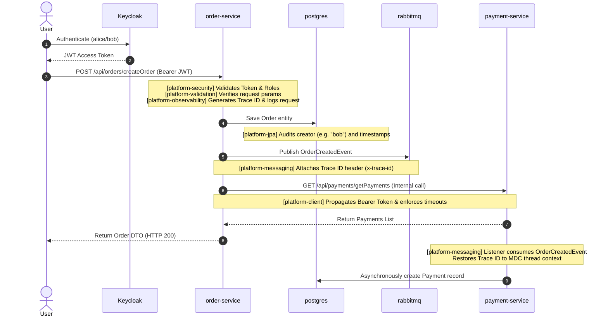

# 🚀 Spring Monorepo Platform

A **production-oriented internal developer platform (IDP)** for building Spring Boot microservices with:

* 🚀 Automated service scaffolding
* 📦 Shared platform modules (Observability, Security, Client, Exception Handling, Database, Messaging, Validation)
* 📊 Built-in observability (logs + metrics + tracing)
* 🔒 Centralized JWT Authentication & Authorization
* 🛠️ Robust input validation & standardized exception reporting
* 🔁 Resilient inter-service communication with token propagation
* 🐳 Multi-service local Docker Compose environment

---

## 🏗️ Architecture

```
spring-monorepo/
├── buildSrc/                      # Shared Gradle conventions
├── gradle/                        # Version catalog (libs.versions.toml)
│
├── services/                      # Microservices
│   ├── order-service/             # Order processing with RabbitMQ events
│   ├── payment-service/           # Payment processing with async event consumer
│   └── notification-service/      # SMS/Email notification system
│
├── libraries/                     # Shared Platform Libraries
│   ├── platform-observability/    # AOP request tracking, MDC, Prometheus metrics
│   ├── platform-security/         # OAuth2 Resource Server & Keycloak role mapper
│   ├── platform-exceptions/       # Unified RestControllerAdvice & error schemas
│   ├── platform-client/           # Resilient RestClient.Builder & Bearer propagation
│   ├── platform-jpa/              # Dynamic DB auto-creator, JPA auditing & Flyway migrations
│   ├── platform-messaging/        # RabbitMQ trace correlation headers
│   └── platform-validation/       # JSR-380 validators (@Alphanumeric, @EnumValue, @Password, @PhoneNumber)
│
├── docker-compose.yml             # Local backing systems & services compose
├── prometheus.yml                # Metrics scraping configuration
│
├── build.gradle                   # Parent build file including the service scaffolding task
├── settings.gradle                # Registers all libraries and microservices
└── gradlew                        # Gradle Wrapper
```

---

## ⚙️ Tech Stack

* **Java**: Version 21
* **Spring Boot**: Version 4.0.6
* **Gradle**: Version 8.14 (multi-module)
* **Observability**: Micrometer, Prometheus, Grafana
* **Logging**: SLF4J + MDC (structured JSON logs via Logback)
* **Security**: Spring Security OAuth2 Resource Server, Keycloak 24
* **Database & Migrations**: Spring Data JPA, Hibernate, PostgreSQL 18, Flyway, H2 (for test scope)
* **Messaging**: Spring AMQP, RabbitMQ
* **Validation**: Jakarta Validation (JSR-380 / Hibernate Validator)

---

## 🛠️ System Runtime Flow

The diagram below maps how platform libraries coordinate during a standard cross-service request flow:



---

## 📦 Detailed Platform Modules

### 1. `platform-observability`
Provides centralized tracking and telemetry.
* `@Track` annotation (AOP-based method tracing).
* Automatic logger logging for execution success, failure, and execution latency.
* TraceId Filter (MDC) generating request context IDs.
* Prometheus metrics scraping endpoints (`business_operation_success_total`, `business_operation_failure_total`, `business_operation_latency_seconds`).

### 2. `platform-security`
Centralizes JWT verification and security access rules.
* Auto-configures Web Security filter chains.
* Decodes JWT tokens issued by Keycloak.
* Extracts realm-level client roles (`realm_access.roles`) and prefix maps them to Spring authorities (e.g. `ROLE_ADMIN`, `ROLE_USER`).
* Enables method-level protection (`@PreAuthorize`).

### 3. `platform-exceptions`
Enforces standard API response structures across all endpoints.
* `@RestControllerAdvice` capturing all exceptions.
* Maps `DomainException` to structured JSON errors carrying domain status and specific codes.
* Intercepts `ConstraintViolationException` and `MethodArgumentNotValidException` to return parameter-level field validation details.

### 4. `platform-client`
Enables secure inter-service API communications.
* Provides a pre-configured `RestClient.Builder`.
* Injects connection timeout (5s) and read timeout (10s) defaults.
* Automatically propagates bearer tokens from the active security context using `BearerTokenInterceptor`.

### 5. `platform-jpa`
Standardizes persistence configuration.
* Custom `DatabaseAutoCreator` bean checks target databases (`orderdb`, `paymentdb`, etc.) on start and triggers administrative `CREATE DATABASE` commands on PostgreSQL dynamically.
* `BaseAuditEntity` maps base audit fields (`createdAt`, `createdBy`, etc.) with security context auto-filling (`AuditorAware`).
* Automates Flyway schema migrations on startup.

### 6. `platform-messaging`
Provides robust asynchronous messaging patterns.
* Standardizes Jackson JSON object serialization on `RabbitTemplate`.
* Tracing post-processors (`AmqpTracePostProcessor` & `AmqpTraceAdvice`) serialize and deserialize MDC trace context via `x-trace-id` headers in AMQP messages.
* Safely configures `DummyRabbitTemplate` to avoid connection attempts during mock-mode test runs.

### 7. `platform-validation`
Custom constraints for parameter and request payloads.
* `@Alphanumeric`: Enforces alphanumeric input strings.
* `@EnumValue`: Assures a parameter matches valid values of a specified Java Enum class (case-insensitively).
* `@Password`: Validates passwords require at least 8 characters, one lowercase, one uppercase, one digit, and one special character.
* `@PhoneNumber`: Enforces E.164 international phone number formats (e.g., `+1234567890`).

---

## 🚀 Getting Started

### Prerequisites
* Java 21
* Docker + Docker Compose

### Clone
```bash
git clone <your-repo-url>
cd spring-monorepo
```

### Build
```bash
./gradlew clean build
```

---

## 🏗️ Create a New Service

Our custom generator scaffolding task sets up the structure, conventions, and Flyway migration layout:

```bash
# Generate inventory service
./gradlew createService -PserviceName=inventory-service -PpackageName=com.example.inventory
```

---

## 🐳 Run Full Local Environment

### Start Backing Stack & Apps
```bash
docker compose up -d --build
```

### Port Mappings

| Service | Address | Security Context |
| :--- | :--- | :--- |
| **order-service** | `http://localhost:8080/api` | JWT Authenticated (Requires Bearer token) |
| **payment-service** | `http://localhost:8081/api` | JWT Authenticated (Requires Bearer token) |
| **notification-service** | `http://localhost:8083/api` | JWT Authenticated (Requires Bearer token) |
| **Keycloak Console** | `http://localhost:8082` | Credentials: `admin` / `admin` |
| **RabbitMQ Dashboard** | `http://localhost:15672` | Credentials: `guest` / `guest` |
| **Prometheus Server** | `http://localhost:9090` | Public Metrics |
| **Grafana Dashboards** | `http://localhost:3000` | Local telemetry boards |

---

## 🛠️ Verification & Sign-Off Manual Tests

### Step A: Fetch Tokens from Keycloak
Request OAuth2 tokens using the credentials configured in `keycloak/example-realm.json`:

* **Get `ADMIN` Token (Bob - USER + ADMIN permissions)**:
  ```bash
  ADMIN_TOKEN=$(curl -s -X POST http://localhost:8082/realms/example/protocol/openid-connect/token \
    -d "client_id=monorepo-client" \
    -d "username=bob" \
    -d "password=password" \
    -d "grant_type=password" | jq -r .access_token)
  ```

* **Get `USER` Token (Alice - USER permission only)**:
  ```bash
  USER_TOKEN=$(curl -s -X POST http://localhost:8082/realms/example/protocol/openid-connect/token \
    -d "client_id=monorepo-client" \
    -d "username=alice" \
    -d "password=password" \
    -d "grant_type=password" | jq -r .access_token)
  ```

---

### Step B: Validate Security & Exception Formatting
1. **Request Order List (requires USER permission) using Alice's Token** (Expected: `200 OK`):
   ```bash
   curl -i -H "Authorization: Bearer $USER_TOKEN" http://localhost:8080/api/orders/getOrders
   ```
2. **Create Order (requires ADMIN permission) using Alice's Token** (Expected: `403 Forbidden` standard error DTO):
   ```bash
   curl -i -H "Authorization: Bearer $USER_TOKEN" -X POST "http://localhost:8080/api/orders/createOrder?product=Keyboard&price=150.00"
   ```

---

### Step C: Trigger Input Validation Checks
1. **Test `@Alphanumeric` validation (order-service)** (Expected: `400 Bad Request` validation payload):
   ```bash
   curl -i -H "Authorization: Bearer $ADMIN_TOKEN" -X POST "http://localhost:8080/api/orders/createOrder?product=Watch!!!&price=10.0"
   ```
2. **Test `@EnumValue` validation (payment-service)** (Expected: `400 Bad Request` validation payload):
   ```bash
   curl -i -H "Authorization: Bearer $ADMIN_TOKEN" -X POST "http://localhost:8081/api/payments/doPayment?amount=100.0&status=UNKNOWN"
   ```
3. **Test `@PhoneNumber` and `@Password` validations (notification-service)**:
   * **Fail check**:
     ```bash
     curl -i -H "Authorization: Bearer $USER_TOKEN" -X POST "http://localhost:8083/api/notifications/validateContact?phone=123&password=weak"
     ```
   * **Pass check**:
     ```bash
     curl -i -H "Authorization: Bearer $USER_TOKEN" -X POST "http://localhost:8083/api/notifications/validateContact?phone=%2b447911123456&password=SecurePass123%21"
     ```

---

## 🌐 API Guidelines & Structure

All endpoints operate under the `/api` prefix path.

### Business APIs
```
/api/...
```
Example:
* `GET  /api/orders/getOrders`
* `POST /api/orders/createOrder`
* `POST /api/payments/doPayment`

### Actuator Monitoring APIs
```
/api/actuator/...
```
Example:
* `/api/actuator/health`
* `/api/actuator/prometheus`

---

## 🧠 Design Principles

1. **Separation of Concerns**: Business services focus entirely on domain logic, while shared libraries solve cross-cutting infrastructure concerns.
2. **Convention over Configuration**: Shared libraries automatically wire configs upon import using Spring Auto-Configuration.
3. **Resilient & Observable**: Distributed traces propagate down the line automatically across HTTP calls and RabbitMQ queues.
4. **Isolated Test Scope**: Unit/integration tests bypass messaging connections and external systems by running local test profiles.

---

## 🔮 Future Improvements

* OpenTelemetry agent integration
* Distributed tracing visualization (Jaeger)
* Centralized log aggregation (Loki / ELK stack)
* Spring Cloud API Gateway integration
* Kubernetes deployment configurations

---

## 💡 Quick Reference Commands

```bash
# Compile and build all modules
./gradlew build

# Run unit and integration tests
./gradlew test

# Scaffolding: Create a new service
./gradlew createService -PserviceName=<name> -PpackageName=<package>

# Run a service locally in development mode
./gradlew :services:<name>:bootRun

# Start all Docker services
docker compose up -d --build
```
